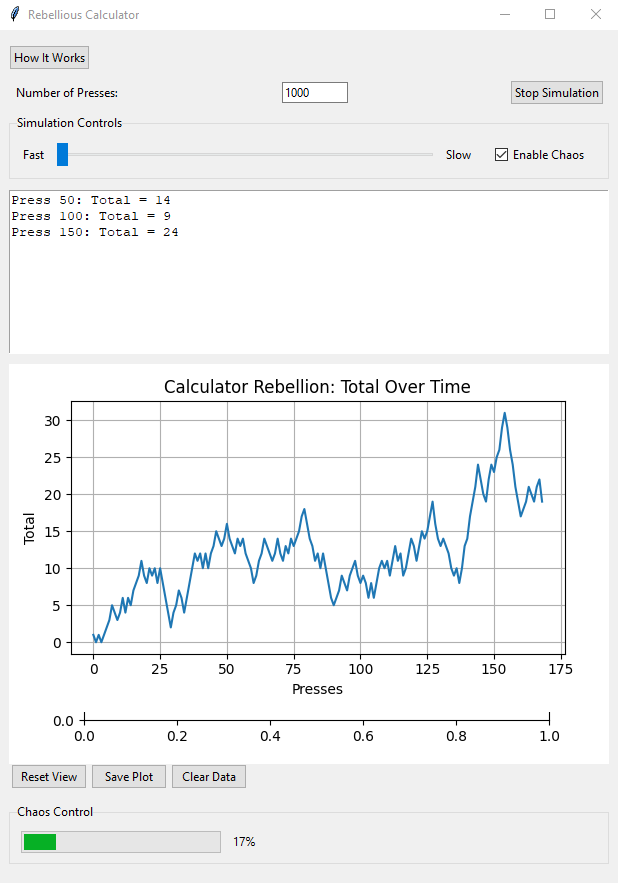

# Rebellious Calculator



A unique visualization tool that demonstrates the transition from order to chaos through a simple numerical system. This interactive application shows how complex patterns can emerge from basic rules, illustrating concepts from chaos theory and complex systems.

## Features

- **Three Distinct Phases:**
  1. Orderly Phase (First 5 presses)
  2. Standard Chaos (Presses 6-100)
  3. Growing Chaos (After press 100)

- **Adaptive Memory System:**
  - Tracks last 100 operations
  - Analyzes recent patterns
  - Biases against repetitive behavior
  - 30% chance to choose least-used recent operation

- **Interactive Controls:**
  - Adjustable simulation speed
  - Start/Stop functionality
  - Toggleable chaos mode
  - Real-time visualization

- **Visual Feedback:**
  - Dynamic plotting of results
  - Real-time total tracking
  - Progress updates

## Memory System Deep Dive

The calculator implements a sophisticated memory system that influences its decision-making process:

### Memory Mechanics
1. **Operation Tracking**
   - Maintains a rolling history of the last 100 operations
   - Each operation (+1, -1, +2, -2, +3, -3) is stored in sequence
   - Memory starts influencing decisions after 5 operations

2. **Pattern Analysis**
   - Analyzes the most recent 5 operations
   - Identifies which operations are used least frequently
   - Creates a bias towards variety in operations
   - Prevents repetitive patterns from dominating

3. **Decision Making**
   - 30% probability of choosing the least-used recent operation
   - 70% probability of random selection from possible values
   - Balances between pattern-breaking and randomness
   - Maintains unpredictability while avoiding repetition

4. **Phase Integration**
   - Memory system works alongside existing chaos phases
   - Early phase: Memory builds but doesn't influence (first 5 presses)
   - Standard chaos: Memory influences available operations (±1, ±2)
   - Growing chaos: Memory influences expanded operation set (±1, ±2, ±3)

This memory system adds a layer of "learning" to the calculator's rebellion, making it more sophisticated in its chaos generation while maintaining unpredictable behavior patterns.

### Mathematical Foundation

1. **Probability Distribution**
   - P(least used) = 0.3 (30% chance of pattern-breaking)
   - P(random choice) = 0.7 (70% chance of standard behavior)
   - Expected value shifts based on memory influence

2. **Pattern Analysis**
   - Frequency analysis of recent operations: f(op) = count(op) / window_size
   - Least used operation: op_min = min(f(op)) for all operations
   - Memory window size = 5 operations (short-term memory)
   - Total memory capacity = 100 operations (long-term memory)

3. **Entropy Calculation**
   - System entropy increases with memory influence
   - H(X) = -Σ P(x) log₂ P(x)
   - Higher entropy indicates more unpredictable behavior
   - Memory system maintains minimum entropy threshold

### Examples of Memory Influence

1. **Pattern Breaking Example:**
   ```
   Recent operations: [+1, +1, +1, +2, +1]
   Least used: {-1, -2, +2} (each appears 0 times)
   Next operation: 30% chance of choosing from least used
   Result: Higher probability of -1, -2, or +2 to break +1 pattern
   ```

2. **Balanced Distribution Example:**
   ```
   Recent operations: [+1, -1, +2, -2, +1]
   Even distribution detected
   Next operation: 70% chance of pure random choice
   Result: Maintains natural chaos without forced pattern breaking
   ```

3. **Phase Transition Example:**
   ```
   Operations at press 98-102: [+2, +2, -1, +1, -2]
   Chaos level increases after press 100
   Memory analysis shows lack of ±3 operations
   Result: Higher probability of introducing ±3 operations
   ```

4. **Long-term Memory Effect:**
   ```
   Last 20 operations heavily favor positive values
   Memory system detects imbalance
   Result: Increased probability of negative values
   Demonstrates self-correcting tendency
   ```

### Impact on System Behavior

1. **Short-term Effects**
   - Prevents immediate repetition
   - Breaks emerging patterns
   - Maintains local unpredictability

2. **Long-term Effects**
   - Balances operation distribution
   - Creates meta-patterns of pattern-breaking
   - Exhibits self-organizing behavior
   - Maintains global chaos while preventing stagnation

## How It Works

The calculator follows a progression from predictable behavior to chaos:

1. **Orderly Phase:**
   - Odd presses: Add 1
   - Even presses: Subtract 1
   - Perfectly predictable pattern

2. **Standard Chaos:**
   - Random operations between +1, -1, +2, -2
   - Equal probability distribution
   - Introduction of unpredictability

3. **Growing Chaos:**
   - Chaos level gradually increases
   - New operations (+3, -3) become possible
   - Increasing probability of extreme values
   - Maximum chaos at 500 presses

## Installation

1. Clone the repository:

```bash
git clone https://github.com/yourusername/rebellious-calculator.git
```

2. Install required packages:
```bash
pip install -r requirements.txt
```

3. Run the application:
```bash
python src/main.py
```

## Requirements

- Python 3.x
- tkinter
- matplotlib
- numpy

## Mathematical & Philosophical Background

The application demonstrates several key concepts:

- Emergence of complexity from simple rules
- Transition between order and chaos
- Random walk properties
- Statistical behavior patterns
- Chaos theory principles

For a deeper understanding, explore the "Deep Analysis" section in the application.

## Contributing

Feel free to fork the repository and submit pull requests. For major changes, please open an issue first to discuss what you would like to change.

## License

[MIT](https://choosealicense.com/licenses/mit/)

